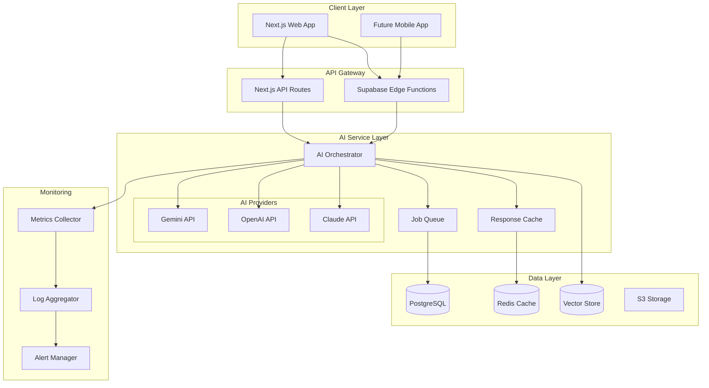

# ClaimGuardian AI Technical Architecture
*Scalable Foundation for Customer-Centric AI Features*

## Architecture Overview



## Core Components

### 1. AI Service Package Structure

```
packages/ai-services/
├── src/
│   ├── index.ts                 # Main exports
│   ├── providers/
│   │   ├── base.provider.ts     # Abstract provider interface
│   │   ├── gemini.provider.ts   # Google Gemini implementation
│   │   ├── openai.provider.ts   # OpenAI implementation
│   │   ├── claude.provider.ts   # Anthropic Claude implementation
│   │   └── index.ts
│   ├── orchestrator/
│   │   ├── orchestrator.ts      # Main AI orchestration logic
│   │   ├── router.ts            # Route requests to appropriate provider
│   │   ├── context.ts           # Maintain conversation context
│   │   └── memory.ts            # Long-term memory management
│   ├── cache/
│   │   ├── cache.manager.ts     # Cache orchestration
│   │   ├── strategies/          # Different caching strategies
│   │   └── invalidation.ts      # Cache invalidation logic
│   ├── monitoring/
│   │   ├── metrics.ts           # Performance metrics
│   │   ├── cost-tracker.ts      # Track API costs
│   │   ├── usage.ts             # User usage patterns
│   │   └── alerts.ts            # Alert conditions
│   ├── features/
│   │   ├── clara/               # Emotional support AI
│   │   ├── clarity/             # Claim calculator AI
│   │   ├── max/                 # Negotiation AI
│   │   └── sentinel/            # Deadline guardian AI
│   └── utils/
│       ├── prompts.ts           # Prompt templates
│       ├── validators.ts        # Response validation
│       └── safety.ts            # Content safety checks
├── tests/
├── package.json
└── tsconfig.json
```

### 2. AI Provider Interface

```typescript
// packages/ai-services/src/providers/base.provider.ts

export interface AIProvider {
  name: string;
  
  // Text generation
  generateText(params: GenerateTextParams): Promise<AIResponse>;
  
  // Chat conversation
  chat(params: ChatParams): Promise<ChatResponse>;
  
  // Embeddings for semantic search
  generateEmbedding(text: string): Promise<number[]>;
  
  // Image analysis
  analyzeImage?(params: ImageAnalysisParams): Promise<ImageAnalysisResponse>;
  
  // Cost estimation
  estimateCost(params: any): number;
}

export interface GenerateTextParams {
  prompt: string;
  maxTokens?: number;
  temperature?: number;
  systemPrompt?: string;
  examples?: Example[];
  responseFormat?: 'text' | 'json';
}

export interface AIResponse {
  text: string;
  usage: {
    promptTokens: number;
    completionTokens: number;
    totalCost: number;
  };
  model: string;
  cached: boolean;
  latency: number;
}
```

### 3. AI Orchestrator

```typescript
// packages/ai-services/src/orchestrator/orchestrator.ts

export class AIOrchestrator {
  private providers: Map<string, AIProvider>;
  private cache: CacheManager;
  private costTracker: CostTracker;
  private contextManager: ContextManager;
  
  async process(request: AIRequest): Promise<AIResponse> {
    // 1. Check cache
    const cached = await this.cache.get(request);
    if (cached) return cached;
    
    // 2. Route to appropriate provider
    const provider = this.selectProvider(request);
    
    // 3. Enhance with context
    const enhancedRequest = await this.contextManager.enhance(request);
    
    // 4. Execute with fallback
    let response;
    try {
      response = await provider.process(enhancedRequest);
    } catch (error) {
      // Fallback to alternative provider
      response = await this.fallbackProvider.process(enhancedRequest);
    }
    
    // 5. Track costs
    await this.costTracker.track(request.userId, response.usage);
    
    // 6. Cache response
    await this.cache.set(request, response);
    
    // 7. Return with metadata
    return {
      ...response,
      provider: provider.name,
      cached: false,
      context: enhancedRequest.context
    };
  }
  
  private selectProvider(request: AIRequest): AIProvider {
    // Smart routing based on:
    // - Feature requirements (Clara needs empathy, Max needs analysis)
    // - Cost optimization (use cheaper models for simple tasks)
    // - Availability (failover if primary is down)
    // - User tier (premium users get better models)
    
    if (request.feature === 'clara') {
      return this.providers.get('claude'); // Best for empathy
    } else if (request.feature === 'clarity') {
      return this.providers.get('gemini'); // Good for calculations
    } else if (request.feature === 'max') {
      return this.providers.get('openai'); // Best for analysis
    }
    
    return this.providers.get('gemini'); // Default
  }
}
```

### 4. Caching Strategy

```typescript
// packages/ai-services/src/cache/strategies/semantic-cache.ts

export class SemanticCache implements CacheStrategy {
  private vectorStore: VectorStore;
  private similarityThreshold = 0.85;
  
  async get(request: AIRequest): Promise<AIResponse | null> {
    // 1. Generate embedding for request
    const embedding = await this.generateEmbedding(request.prompt);
    
    // 2. Search for similar requests
    const similar = await this.vectorStore.search(embedding, {
      threshold: this.similarityThreshold,
      limit: 1
    });
    
    if (similar.length > 0 && similar[0].score > this.similarityThreshold) {
      // 3. Return cached response with cache metadata
      return {
        ...similar[0].response,
        cached: true,
        cacheScore: similar[0].score
      };
    }
    
    return null;
  }
  
  async set(request: AIRequest, response: AIResponse): Promise<void> {
    const embedding = await this.generateEmbedding(request.prompt);
    
    await this.vectorStore.upsert({
      id: generateHash(request),
      embedding,
      metadata: {
        request,
        response,
        timestamp: Date.now(),
        ttl: this.calculateTTL(request)
      }
    });
  }
  
  private calculateTTL(request: AIRequest): number {
    // Dynamic TTL based on request type
    if (request.feature === 'clarity') {
      return 7 * 24 * 60 * 60 * 1000; // 7 days for calculations
    } else if (request.feature === 'clara') {
      return 60 * 60 * 1000; // 1 hour for emotional responses
    }
    return 24 * 60 * 60 * 1000; // 24 hours default
  }
}
```

### 5. Feature-Specific Implementations

#### Clara (Emotional Support AI)

```typescript
// packages/ai-services/src/features/clara/clara.service.ts

export class ClaraService {
  private orchestrator: AIOrchestrator;
  private sentimentAnalyzer: SentimentAnalyzer;
  private crisisDetector: CrisisDetector;
  
  async respond(message: string, userId: string): Promise<ClaraResponse> {
    // 1. Analyze sentiment
    const sentiment = await this.sentimentAnalyzer.analyze(message);
    
    // 2. Check for crisis
    const crisis = await this.crisisDetector.check(message);
    if (crisis.detected) {
      return this.handleCrisis(crisis, userId);
    }
    
    // 3. Get conversation history
    const history = await this.getConversationHistory(userId);
    
    // 4. Generate empathetic response
    const response = await this.orchestrator.process({
      feature: 'clara',
      prompt: this.buildPrompt(message, sentiment, history),
      systemPrompt: CLARA_SYSTEM_PROMPT,
      temperature: 0.8, // More creative/empathetic
      responseFormat: 'json'
    });
    
    // 5. Extract structured response
    const parsed = JSON.parse(response.text) as {
      message: string;
      suggestedActions: string[];
      emotionalTone: string;
    };
    
    // 6. Save to conversation history
    await this.saveConversation(userId, message, parsed);
    
    return {
      ...parsed,
      sentiment: sentiment.score,
      requiresHumanReview: sentiment.score < -0.5
    };
  }
  
  private buildPrompt(
    message: string, 
    sentiment: SentimentResult,
    history: ConversationHistory
  ): string {
    return `
You are Clara, an empathetic AI companion helping a homeowner through their insurance claim.

Conversation context:
- User's emotional state: ${sentiment.primaryEmotion} (${sentiment.score})
- Previous topics discussed: ${history.topics.join(', ')}
- Days since claim started: ${history.daysSinceStart}
- Current claim status: ${history.claimStatus}

User message: "${message}"

Respond with empathy and understanding. If they're struggling, acknowledge their feelings.
Provide practical next steps when appropriate. Celebrate their progress.

Response format:
{
  "message": "Your empathetic response here",
  "suggestedActions": ["Actionable next steps"],
  "emotionalTone": "supportive|encouraging|calming|celebratory"
}
`;
  }
}
```

#### Clarity (Transparent Calculator AI)

```typescript
// packages/ai-services/src/features/clarity/clarity.service.ts

export class ClarityService {
  async calculateClaim(claimData: ClaimData): Promise<CalculationResult> {
    // 1. Break down calculation into steps
    const steps = this.generateCalculationSteps(claimData);
    
    // 2. For each step, generate explanation
    const explainedSteps = await Promise.all(
      steps.map(async (step) => {
        const explanation = await this.orchestrator.process({
          feature: 'clarity',
          prompt: `Explain in simple terms: ${step.description}`,
          systemPrompt: CLARITY_EXPLANATION_PROMPT,
          temperature: 0.3, // More factual/consistent
          examples: INSURANCE_TERM_EXAMPLES
        });
        
        return {
          ...step,
          explanation: explanation.text,
          sources: this.extractSources(explanation.text)
        };
      })
    );
    
    // 3. Generate summary
    const summary = await this.generateSummary(explainedSteps);
    
    return {
      totalValue: this.calculateTotal(steps),
      steps: explainedSteps,
      summary,
      confidence: 0.85,
      lastUpdated: new Date()
    };
  }
}
```

### 6. Database Schema Extensions

```sql
-- AI interaction tracking
CREATE TABLE ai_interactions (
  id UUID PRIMARY KEY DEFAULT uuid_generate_v4(),
  user_id UUID REFERENCES auth.users(id),
  feature VARCHAR(50) NOT NULL, -- clara, clarity, max, etc.
  request_type VARCHAR(50) NOT NULL,
  request_hash VARCHAR(64), -- For cache lookup
  request_tokens INTEGER,
  response_tokens INTEGER,
  total_cost DECIMAL(10, 6),
  provider VARCHAR(50),
  model VARCHAR(100),
  latency_ms INTEGER,
  cached BOOLEAN DEFAULT FALSE,
  cache_score DECIMAL(3, 2), -- Similarity score if cached
  created_at TIMESTAMP WITH TIME ZONE DEFAULT NOW()
);

-- Conversation memory for Clara
CREATE TABLE ai_conversations (
  id UUID PRIMARY KEY DEFAULT uuid_generate_v4(),
  user_id UUID REFERENCES auth.users(id),
  feature VARCHAR(50) NOT NULL,
  message_role VARCHAR(20) NOT NULL, -- user, assistant
  message_content TEXT NOT NULL,
  sentiment_score DECIMAL(3, 2),
  emotional_state VARCHAR(50),
  metadata JSONB,
  created_at TIMESTAMP WITH TIME ZONE DEFAULT NOW()
);

-- AI cost tracking per user
CREATE TABLE ai_usage_costs (
  user_id UUID REFERENCES auth.users(id),
  period_start DATE NOT NULL,
  feature VARCHAR(50) NOT NULL,
  request_count INTEGER DEFAULT 0,
  total_tokens INTEGER DEFAULT 0,
  total_cost DECIMAL(10, 2) DEFAULT 0,
  PRIMARY KEY (user_id, period_start, feature)
);

-- Indexes for performance
CREATE INDEX idx_ai_interactions_user_feature ON ai_interactions(user_id, feature);
CREATE INDEX idx_ai_interactions_cache ON ai_interactions(request_hash) WHERE cached = false;
CREATE INDEX idx_ai_conversations_user ON ai_conversations(user_id, created_at DESC);
```

### 7. Edge Function Integration

```typescript
// supabase/functions/ai-orchestrator/index.ts

import { serve } from "https://deno.land/std@0.168.0/http/server.ts";
import { createClient } from "https://esm.sh/@supabase/supabase-js@2";
import { AIOrchestrator } from "./ai-orchestrator.ts";

const orchestrator = new AIOrchestrator({
  providers: {
    gemini: new GeminiProvider(Deno.env.get("GEMINI_API_KEY")),
    openai: new OpenAIProvider(Deno.env.get("OPENAI_API_KEY")),
    claude: new ClaudeProvider(Deno.env.get("ANTHROPIC_API_KEY"))
  },
  cache: new RedisCache(Deno.env.get("REDIS_URL")),
  costTracker: new SupabaseCostTracker()
});

serve(async (req) => {
  try {
    const { feature, request } = await req.json();
    
    // Authenticate user
    const authHeader = req.headers.get("Authorization");
    const token = authHeader?.replace("Bearer ", "");
    const { data: { user } } = await supabase.auth.getUser(token);
    
    if (!user) {
      return new Response("Unauthorized", { status: 401 });
    }
    
    // Check rate limits
    const rateLimitOk = await checkRateLimit(user.id, feature);
    if (!rateLimitOk) {
      return new Response("Rate limit exceeded", { status: 429 });
    }
    
    // Process request
    const response = await orchestrator.process({
      ...request,
      feature,
      userId: user.id
    });
    
    return new Response(JSON.stringify(response), {
      headers: { "Content-Type": "application/json" },
    });
    
  } catch (error) {
    console.error("AI orchestration error:", error);
    return new Response(
      JSON.stringify({ error: "Internal server error" }), 
      { status: 500 }
    );
  }
});
```

### 8. Monitoring & Observability

```typescript
// packages/ai-services/src/monitoring/dashboard.ts

export class AIMonitoringDashboard {
  private metrics: MetricsCollector;
  
  async getRealtimeMetrics(): Promise<DashboardMetrics> {
    return {
      // Performance metrics
      performance: {
        avgLatency: await this.metrics.getAverage('latency', '5m'),
        p95Latency: await this.metrics.getPercentile('latency', 95, '5m'),
        requestsPerMinute: await this.metrics.getRate('requests', '1m'),
        cacheHitRate: await this.metrics.getRatio('cache_hits', 'requests', '5m')
      },
      
      // Cost metrics
      costs: {
        lastHour: await this.metrics.getSum('cost', '1h'),
        today: await this.metrics.getSum('cost', '24h'),
        byProvider: await this.metrics.getGroupedSum('cost', 'provider', '24h'),
        byFeature: await this.metrics.getGroupedSum('cost', 'feature', '24h')
      },
      
      // Quality metrics
      quality: {
        sentimentAccuracy: await this.getSentimentAccuracy(),
        userSatisfaction: await this.getUserSatisfaction(),
        escalationRate: await this.getEscalationRate()
      },
      
      // Alerts
      alerts: await this.getActiveAlerts()
    };
  }
}
```

### 9. Security & Privacy

```typescript
// packages/ai-services/src/utils/safety.ts

export class AISafetyFilter {
  // PII detection and removal
  async sanitizeInput(text: string): Promise<string> {
    // Remove SSN patterns
    text = text.replace(/\b\d{3}-\d{2}-\d{4}\b/g, '[SSN REMOVED]');
    
    // Remove credit card patterns
    text = text.replace(/\b\d{4}[\s-]?\d{4}[\s-]?\d{4}[\s-]?\d{4}\b/g, '[CC REMOVED]');
    
    // Use AI to detect other PII
    const piiDetection = await this.detectPII(text);
    for (const pii of piiDetection) {
      text = text.replace(pii.text, `[${pii.type} REMOVED]`);
    }
    
    return text;
  }
  
  // Content safety
  async checkContentSafety(text: string): Promise<SafetyCheck> {
    const checks = await Promise.all([
      this.checkHarmfulContent(text),
      this.checkLegalCompliance(text),
      this.checkMedicalAdvice(text)
    ]);
    
    return {
      safe: checks.every(c => c.safe),
      warnings: checks.flatMap(c => c.warnings),
      blockedReasons: checks.filter(c => !c.safe).map(c => c.reason)
    };
  }
}
```

### 10. Performance Optimization

```typescript
// packages/ai-services/src/optimization/batching.ts

export class RequestBatcher {
  private queue: Map<string, PendingRequest[]> = new Map();
  private batchSize = 10;
  private batchTimeout = 100; // ms
  
  async add(request: AIRequest): Promise<AIResponse> {
    return new Promise((resolve, reject) => {
      const key = this.getBatchKey(request);
      
      if (!this.queue.has(key)) {
        this.queue.set(key, []);
        
        // Start batch timer
        setTimeout(() => this.processBatch(key), this.batchTimeout);
      }
      
      this.queue.get(key)!.push({ request, resolve, reject });
      
      // Process immediately if batch is full
      if (this.queue.get(key)!.length >= this.batchSize) {
        this.processBatch(key);
      }
    });
  }
  
  private async processBatch(key: string): Promise<void> {
    const batch = this.queue.get(key) || [];
    if (batch.length === 0) return;
    
    this.queue.delete(key);
    
    try {
      // Batch process with provider
      const responses = await this.provider.batchProcess(
        batch.map(b => b.request)
      );
      
      // Resolve individual promises
      batch.forEach((item, index) => {
        item.resolve(responses[index]);
      });
    } catch (error) {
      batch.forEach(item => item.reject(error));
    }
  }
}
```

## Deployment Architecture

### Infrastructure as Code

```yaml
# kubernetes/ai-services.yaml
apiVersion: apps/v1
kind: Deployment
metadata:
  name: ai-orchestrator
spec:
  replicas: 3
  selector:
    matchLabels:
      app: ai-orchestrator
  template:
    metadata:
      labels:
        app: ai-orchestrator
    spec:
      containers:
      - name: orchestrator
        image: claimguardian/ai-orchestrator:latest
        env:
        - name: REDIS_URL
          valueFrom:
            secretKeyRef:
              name: ai-secrets
              key: redis-url
        - name: GEMINI_API_KEY
          valueFrom:
            secretKeyRef:
              name: ai-secrets
              key: gemini-key
        resources:
          requests:
            memory: "512Mi"
            cpu: "500m"
          limits:
            memory: "1Gi"
            cpu: "1000m"
        livenessProbe:
          httpGet:
            path: /health
            port: 8080
          initialDelaySeconds: 30
          periodSeconds: 10
```

### Auto-scaling Configuration

```yaml
apiVersion: autoscaling/v2
kind: HorizontalPodAutoscaler
metadata:
  name: ai-orchestrator-hpa
spec:
  scaleTargetRef:
    apiVersion: apps/v1
    kind: Deployment
    name: ai-orchestrator
  minReplicas: 2
  maxReplicas: 10
  metrics:
  - type: Resource
    resource:
      name: cpu
      target:
        type: Utilization
        averageUtilization: 70
  - type: Resource
    resource:
      name: memory
      target:
        type: Utilization
        averageUtilization: 80
  - type: Pods
    pods:
      metric:
        name: ai_request_latency_p95
      target:
        type: AverageValue
        averageValue: "2000m" # 2 seconds
```

## Development Workflow

### Local Development Setup

```bash
# Start local services
docker-compose up -d redis postgres

# Install dependencies
pnpm install

# Run AI service in development
pnpm --filter @claimguardian/ai-services dev

# Run tests
pnpm --filter @claimguardian/ai-services test

# Run integration tests with real APIs
INTEGRATION_TEST=true pnpm --filter @claimguardian/ai-services test:integration
```

### Feature Flag Configuration

```typescript
// Feature rollout configuration
export const AI_FEATURES = {
  clara: {
    enabled: process.env.FEATURE_CLARA_ENABLED === 'true',
    rolloutPercentage: parseInt(process.env.FEATURE_CLARA_ROLLOUT || '0'),
    requiredPlan: 'free',
    costPerRequest: 0.02
  },
  clarity: {
    enabled: process.env.FEATURE_CLARITY_ENABLED === 'true',
    rolloutPercentage: parseInt(process.env.FEATURE_CLARITY_ROLLOUT || '0'),
    requiredPlan: 'free',
    costPerRequest: 0.01
  },
  max: {
    enabled: process.env.FEATURE_MAX_ENABLED === 'true',
    rolloutPercentage: parseInt(process.env.FEATURE_MAX_ROLLOUT || '0'),
    requiredPlan: 'premium',
    costPerRequest: 0.05
  }
};
```

This architecture provides a robust foundation for ClaimGuardian's AI features while maintaining flexibility, performance, and cost control. The modular design allows for easy addition of new AI capabilities as the platform grows.