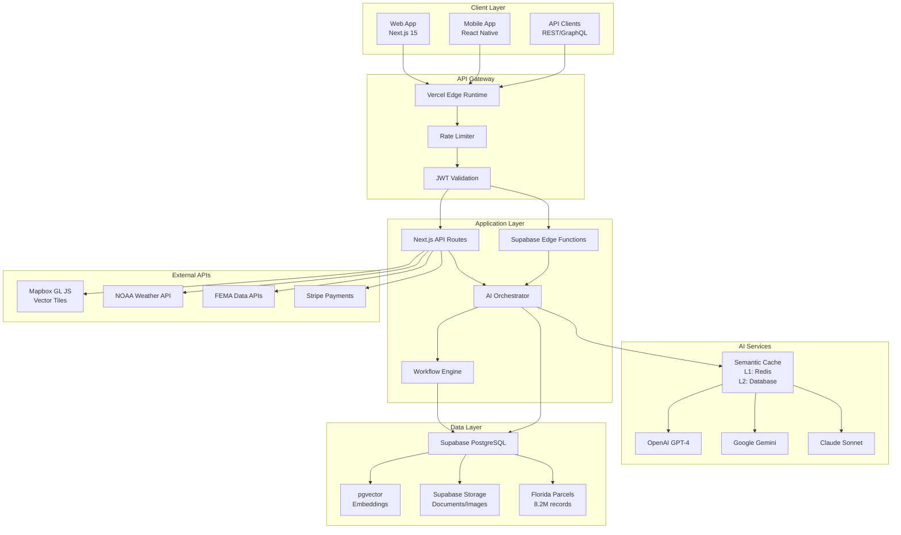
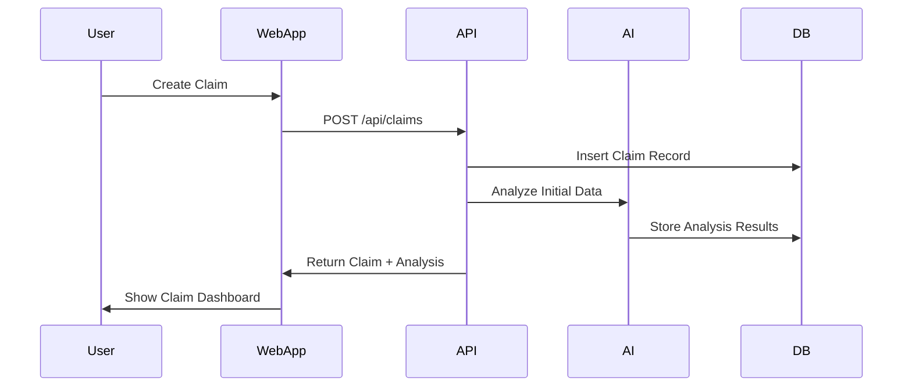
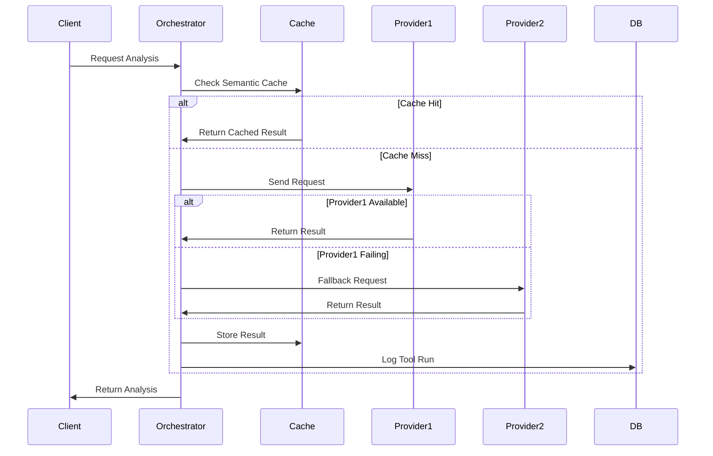
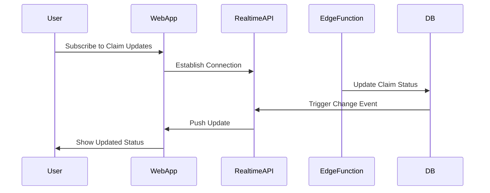

# ClaimGuardian AI-First Platform Architecture

## Overview

ClaimGuardian is an AI-first insurance claim advocacy platform built for Florida property owners. The platform combines advanced mapping with 8.2M+ Florida parcels, multi-provider AI orchestration, and event-driven claim processing to deliver unprecedented value in insurance optimization.

**Mission**: AI-powered insurance claim advocacy with FEMA NIMS compliance
**Live Platform**: https://claimguardianai.com
**Total Investment**: $690K | **Expected Revenue**: $4M+ | **ROI**: 580% Year 1

## Architecture Principles

### 1. AI-First Design
- Multi-provider AI orchestration (OpenAI, Google, Anthropic)
- Semantic caching with L1/L2 hierarchy for cost optimization
- Dynamic routing based on task complexity and provider availability
- Comprehensive AI error handling with circuit breaker patterns

### 2. Event-Driven Architecture
- **Claim Graph**: Immutable event log of all claim activities
- **Event Bus**: Real-time event distribution across services
- **Tool Orchestration**: Pluggable tool system with automatic dependency resolution
- **Workflow Engine**: Visual workflow designer with conditional branching

### 3. Edge-First Performance
- **Supabase Edge Functions**: AI processing at the network edge
- **Vector Tiles**: Optimized parcel data delivery with zoom-based reduction
- **CDN Integration**: Global content delivery with regional caching
- **Progressive Enhancement**: Mobile-first responsive design

### 4. Zero-Trust Security
- **Row Level Security (RLS)**: Database-level access control
- **JWT Authentication**: Stateless authentication with refresh tokens
- **API Rate Limiting**: Prevent abuse and ensure fair usage
- **Audit Logging**: Comprehensive activity tracking for compliance

## System Architecture



## Core Components

### 1. Monorepo Structure

```
claimguardian/
├── apps/
│   ├── web/                 # Next.js 15 web application
│   └── mobile/              # React Native Expo app
├── packages/
│   ├── shared/              # Shared TypeScript interfaces
│   ├── ai-services/         # AI orchestration services
│   ├── db/                  # Database utilities and types
│   └── ui/                  # Shared UI components
├── supabase/
│   ├── functions/           # Edge Functions
│   └── migrations/          # Database migrations
└── docs/                    # Documentation and specs
```

### 2. Database Schema

#### Core Tables
- **claims**: Insurance claim records with status tracking
- **properties**: User property portfolio with parcel integration
- **claim_events**: Immutable event log for claim activities
- **tool_runs**: AI tool execution tracking with caching
- **workflows**: Visual workflow definitions and state
- **fraud_assessments**: AI-powered fraud detection results

#### Florida Parcel Data
- **florida_parcels**: 8.2M+ property records with spatial indexing
- **florida_counties**: County metadata and boundaries
- **parcel_search**: Optimized search indexes and materialized views

#### AI Infrastructure
- **ai_models**: Model configurations and provider settings
- **ai_cache**: Semantic caching with embedding-based retrieval
- **ai_analyses**: AI analysis results with confidence scoring
- **ai_conversations**: Chat history and context management

### 3. AI Orchestration System

#### Provider Management
```typescript
interface AIProvider {
  id: string;
  name: string;
  models: AIModel[];
  rateLimit: RateLimit;
  costPerToken: number;
  capabilities: AICapability[];
}

interface AIModel {
  id: string;
  providerId: string;
  maxTokens: number;
  inputCost: number;
  outputCost: number;
  contextWindow: number;
}
```

#### Semantic Caching
- **L1 Cache**: Redis for hot data (sub-millisecond access)
- **L2 Cache**: PostgreSQL with pgvector for semantic similarity
- **Cache Strategy**: Embedding-based similarity matching with confidence thresholds
- **Invalidation**: Event-driven cache invalidation on data changes

#### Circuit Breaker Pattern
- **Provider Fallbacks**: Automatic failover between AI providers
- **Health Monitoring**: Real-time provider availability tracking
- **Cost Optimization**: Dynamic routing based on cost and performance
- **Error Handling**: Comprehensive error classification and recovery

### 4. Event-Driven Claim Processing

#### Claim Graph Architecture
```typescript
interface ClaimEvent {
  id: string;              // ULID for ordering
  claimId: string;         // Parent claim reference
  eventType: ClaimEventType;
  payload: Record<string, unknown>;
  timestamp: Date;
  userId: string;
  source: EventSource;
  metadata: EventMetadata;
}

interface ClaimState {
  current: ClaimStatus;
  history: ClaimEvent[];
  tools: ToolRun[];
  workflows: WorkflowExecution[];
}
```

#### Tool Orchestration
- **Tool Registry**: Pluggable tool system with automatic discovery
- **Dependency Resolution**: Automatic tool chaining based on outputs
- **Parallel Execution**: Concurrent tool execution where possible
- **Result Caching**: Intelligent caching of tool outputs

### 5. Vector Tile System

#### Parcel Data Optimization
- **Zoom-Based Reduction**: Property filtering based on zoom level
- **Clustering**: Automatic clustering for dense areas
- **Value Filtering**: High-value property emphasis at low zoom
- **Real-Time Updates**: Dynamic tile regeneration on data changes

#### Performance Characteristics
- **Tile Size**: ~50KB average, ~200KB maximum
- **Cache TTL**: 1 hour client, 1 day CDN
- **Compression**: Gzip + Brotli for optimal transfer
- **Indexing**: Spatial R-tree indexes for sub-second queries

## Data Flow Patterns

### 1. Claim Creation Flow


### 2. AI Analysis Pipeline


### 3. Real-Time Updates


## Performance Specifications

### Response Time Targets
- **API Endpoints**: < 200ms P95
- **Vector Tiles**: < 100ms P95
- **AI Analysis**: < 30s P95
- **Database Queries**: < 50ms P95
- **Static Assets**: < 100ms P95

### Throughput Targets
- **Concurrent Users**: 10,000+
- **API Requests**: 1,000 RPS
- **Vector Tile Requests**: 5,000 RPS
- **Real-time Connections**: 1,000 concurrent
- **Database Connections**: 100 pool size

### Scalability Characteristics
- **Horizontal Scaling**: Stateless Edge Functions
- **Database Scaling**: Read replicas + connection pooling
- **CDN Distribution**: Global edge caching
- **Auto-Scaling**: Based on CPU/memory metrics

## Security Architecture

### Authentication & Authorization
- **JWT Tokens**: Stateless authentication with refresh
- **Row Level Security**: Database-level access control
- **Role-Based Access**: Admin, user, and service roles
- **API Key Management**: Secure storage with rotation

### Data Protection
- **Encryption at Rest**: AES-256 database encryption
- **Encryption in Transit**: TLS 1.3 for all connections
- **PII Handling**: Encrypted storage with access logging
- **Audit Trails**: Comprehensive activity logging

### Compliance Standards
- **GDPR**: Data privacy and right to deletion
- **CCPA**: California privacy compliance
- **SOC 2**: Security and availability controls
- **Florida Insurance**: State-specific regulations

## Development Workflow

### Branch Strategy
- **main**: Production deployments
- **develop**: Integration branch for features
- **feature/***: Individual feature development
- **hotfix/***: Critical production fixes

### CI/CD Pipeline
1. **Code Quality**: ESLint, Prettier, TypeScript
2. **Testing**: Unit, integration, and E2E tests
3. **Security**: CodeQL, Semgrep, dependency audits
4. **Performance**: Bundle size, Lighthouse CI
5. **Deployment**: Automated staging and production

### Monitoring & Observability
- **Application Monitoring**: Sentry error tracking
- **Performance Monitoring**: Vercel Analytics
- **Database Monitoring**: Supabase metrics
- **AI Monitoring**: Custom dashboards for model performance

## Deployment Architecture

### Production Infrastructure
- **Web App**: Vercel with global edge network
- **Database**: Supabase with Multi-AZ setup
- **Edge Functions**: Supabase global distribution
- **Storage**: Supabase with CDN integration
- **Monitoring**: Integrated observability stack

### Staging Environment
- **Preview Deployments**: Automatic PR previews
- **Database**: Separate staging instance
- **AI Services**: Test API keys and mocks
- **E2E Testing**: Automated browser testing

### Local Development
- **Docker Compose**: Complete local environment
- **Hot Reloading**: Fast development iteration
- **Database Seeding**: Sample data generation
- **Mock Services**: AI and external API mocks

## Cost Optimization

### AI Cost Management
- **Semantic Caching**: 60% reduction in API calls
- **Provider Routing**: Automatic cost-based routing
- **Token Optimization**: Prompt engineering for efficiency
- **Usage Monitoring**: Real-time cost tracking

### Infrastructure Costs
- **Edge Computing**: Reduced latency and bandwidth
- **CDN Caching**: Minimized origin requests
- **Database Optimization**: Query optimization and indexing
- **Auto-Scaling**: Pay-per-use resource allocation

## Future Roadmap

### Phase 1: Performance Optimization (Completed)
- ✅ Database performance improvements
- ✅ Caching layer implementation
- ✅ Image optimization
- ✅ Code splitting

### Phase 2: FEMA NIMS Compliance (Completed)
- ✅ ICS integration
- ✅ Resource management
- ✅ Emergency communications
- ✅ Disaster workflows

### Phase 3: National Expansion (Q2 2025)
- 🔄 Multi-state parcel data integration
- 🔄 Regional compliance variations
- 🔄 Carrier API integrations
- 🔄 Advanced fraud detection

### Phase 4: Enterprise Features (Q3 2025)
- 📋 White-label solutions
- 📋 Advanced analytics dashboard
- 📋 Bulk claim processing
- 📋 API marketplace

This architecture provides a solid foundation for ClaimGuardian's AI-first platform, supporting both current operations and future scalability requirements while maintaining high performance, security, and reliability standards.