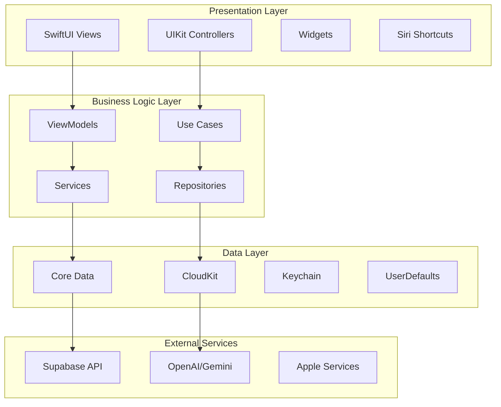
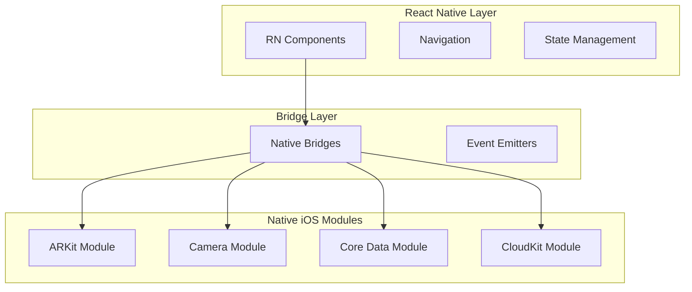
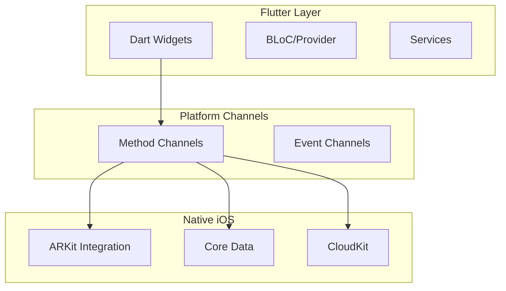

# ADR-001: Native iOS App Architecture for ClaimGuardian Field Assessment

## Status
Proposed

## Context

ClaimGuardian currently has a React Native/Expo mobile app, but the requirements for advanced field damage assessment necessitate a native iOS application to leverage:

1. **Advanced AR capabilities** with ARKit for precise measurement tools
2. **Professional camera controls** with AVFoundation for high-quality documentation
3. **Offline-first architecture** with Core Data and CloudKit synchronization
4. **Apple ecosystem integration** including Siri Shortcuts, Widgets, and Apple Pencil support
5. **Performance optimization** for real-time AI analysis and large file handling

**Business Context:**
- Total Investment: $690K
- Expected Annual Revenue: $1.4M+
- Target Users: Insurance adjusters, property owners, contractors, public adjusters
- iOS market share in enterprise: 70%+ in insurance industry

## Design Options

### Option 1: Pure Native iOS App (SwiftUI + UIKit)

**Architecture:**


**Pros:**
- Maximum performance and native iOS integration
- Full access to ARKit, Core ML, Vision framework
- Best user experience with native UI patterns
- Optimal battery life and memory usage
- Apple ecosystem features (Siri, Widgets, Apple Pencil)
- App Store optimization

**Cons:**
- Single platform (iOS only)
- Higher development cost
- Longer initial development time
- Need iOS-specific expertise

**Technology Stack:**
- SwiftUI for modern UI development
- Combine for reactive programming
- Core Data + CloudKit for data persistence
- AVFoundation for camera controls
- ARKit for measurement tools
- Vision framework for AI analysis

### Option 2: Hybrid Approach (React Native + Native Modules)

**Architecture:**


**Pros:**
- Code sharing with existing RN app
- Faster initial development
- Cross-platform compatibility
- Existing team expertise

**Cons:**
- Performance overhead from bridge
- Complex native module development
- Limited access to some iOS features
- Maintenance complexity
- Less optimal user experience

### Option 3: Flutter + Platform Channels

**Architecture:**


**Pros:**
- Cross-platform development
- Good performance
- Growing ecosystem
- Modern development experience

**Cons:**
- Additional learning curve
- Limited iOS-specific integrations
- Platform channel complexity
- Less mature for AR/ML applications

## Decision

**Selected: Option 1 - Pure Native iOS App**

## Rationale

1. **Performance Requirements**: Real-time AR measurements and AI analysis require maximum performance
2. **User Experience**: Insurance professionals expect polished, native experiences
3. **Feature Access**: Critical features (ARKit, advanced camera, Siri) require deep iOS integration
4. **Market Focus**: 70%+ of insurance industry uses iOS devices
5. **Revenue Impact**: Premium user experience justifies higher development cost
6. **Scalability**: Native architecture scales better for complex workflows

## Implementation Plan

### Phase 1: Core Architecture (Weeks 1-4)

#### 1.1 Project Structure Setup
```
ClaimGuardian-iOS/
├── ClaimGuardian/
│   ├── App/
│   │   ├── AppDelegate.swift
│   │   ├── SceneDelegate.swift
│   │   └── ClaimGuardianApp.swift
│   ├── Features/
│   │   ├── Authentication/
│   │   ├── Dashboard/
│   │   ├── Assessment/
│   │   ├── Camera/
│   │   ├── ARMeasurement/
│   │   └── Settings/
│   ├── Core/
│   │   ├── Data/
│   │   ├── Network/
│   │   ├── Storage/
│   │   └── Utilities/
│   ├── Resources/
│   └── SiriExtension/
├── Widgets/
└── Tests/
```

#### 1.2 Core Data Model
```swift
// Claim Entity
@objc(Claim)
class Claim: NSManagedObject {
    @NSManaged var id: UUID
    @NSManaged var propertyId: UUID
    @NSManaged var title: String
    @NSManaged var status: String
    @NSManaged var createdAt: Date
    @NSManaged var syncStatus: String
    @NSManaged var photos: Set<Photo>
    @NSManaged var damageItems: Set<DamageItem>
}

// Photo Entity
@objc(Photo)
class Photo: NSManagedObject {
    @NSManaged var id: UUID
    @NSManaged var localURL: URL
    @NSManaged var remoteURL: URL?
    @NSManaged var metadata: Data
    @NSManaged var arMeasurements: Data?
    @NSManaged var aiAnalysis: Data?
}

// DamageItem Entity
@objc(DamageItem)
class DamageItem: NSManagedObject {
    @NSManaged var id: UUID
    @NSManaged var category: String
    @NSManaged var description: String
    @NSManaged var severity: String
    @NSManaged var estimatedCost: Double
    @NSManaged var measurements: Data?
}
```

#### 1.3 Network Layer with Supabase
```swift
protocol SupabaseServiceProtocol {
    func authenticate(email: String, password: String) async throws -> User
    func uploadPhoto(_ data: Data, path: String) async throws -> URL
    func syncClaim(_ claim: Claim) async throws
    func fetchProperties() async throws -> [Property]
}

class SupabaseService: SupabaseServiceProtocol {
    private let client: SupabaseClient
    
    init() {
        self.client = SupabaseClient(
            supabaseURL: Config.supabaseURL,
            supabaseKey: Config.supabaseKey
        )
    }
}
```

### Phase 2: Camera & AR System (Weeks 5-8)

#### 2.1 Advanced Camera System
```swift
class CameraController: NSObject, ObservableObject {
    private let session = AVCaptureSession()
    private var photoOutput = AVCapturePhotoOutput()
    private var videoOutput = AVCaptureMovieFileOutput()
    
    @Published var isRecording = false
    @Published var captureMode: CaptureMode = .photo
    
    func configureSession() {
        session.sessionPreset = .hd4K3840x2160
        // Configure for professional photography
    }
    
    func capturePhoto(with settings: PhotoSettings) async throws -> Photo {
        // Professional photo capture with metadata
    }
    
    func startVideoRecording() {
        // 4K video recording for detailed documentation
    }
}
```

#### 2.2 ARKit Measurement System
```swift
class ARMeasurementController: NSObject, ARSessionDelegate {
    private var arSession = ARSession()
    private var measurements: [ARMeasurement] = []
    
    func startMeasurement(from startPoint: SCNVector3) {
        // Begin AR measurement
    }
    
    func endMeasurement(at endPoint: SCNVector3) -> ARMeasurement {
        let distance = startPoint.distance(to: endPoint)
        return ARMeasurement(distance: distance, accuracy: .high)
    }
    
    func measureArea(points: [SCNVector3]) -> AreaMeasurement {
        // Calculate area from AR points
    }
}
```

### Phase 3: AI Integration & Offline Sync (Weeks 9-12)

#### 3.1 AI Analysis Service
```swift
class AIAnalysisService {
    private let openAIClient: OpenAIClient
    private let visionService: VisionService
    
    func analyzeDamage(_ image: UIImage) async throws -> DamageAnalysis {
        // Local Vision framework analysis first
        let localAnalysis = try await visionService.detectObjects(in: image)
        
        // Enhanced analysis with cloud AI
        let enhancedAnalysis = try await openAIClient.analyzeImage(
            image, 
            context: localAnalysis
        )
        
        return DamageAnalysis(
            localResults: localAnalysis,
            enhancedResults: enhancedAnalysis,
            confidence: enhancedAnalysis.confidence
        )
    }
    
    func generateReport(_ claim: Claim) async throws -> PDFDocument {
        // Generate professional PDF report
    }
}
```

#### 3.2 Offline Sync Strategy
```swift
class SyncService: ObservableObject {
    @Published var syncStatus: SyncStatus = .idle
    private let coreDataStack: CoreDataStack
    private let supabaseService: SupabaseService
    
    func performSync() async {
        await withTaskGroup(of: Void.self) { group in
            group.addTask { await self.syncClaims() }
            group.addTask { await self.syncPhotos() }
            group.addTask { await self.syncProperties() }
        }
    }
    
    private func handleConflict(_ local: Claim, _ remote: Claim) -> Claim {
        // Conflict resolution strategy
        return local.updatedAt > remote.updatedAt ? local : remote
    }
}
```

### Phase 4: Apple Ecosystem Integration (Weeks 13-16)

#### 4.1 Siri Shortcuts
```swift
class SiriShortcutService {
    func setupShortcuts() {
        let newAssessment = INIntent.newAssessment()
        let shortcut = INShortcut(intent: newAssessment)
        INVoiceShortcutCenter.shared.setShortcutSuggestions([shortcut])
    }
    
    @available(iOS 14.0, *)
    func handleSiriIntent(_ intent: NewAssessmentIntent) {
        // Handle voice-activated assessment creation
    }
}
```

#### 4.2 iOS Widgets
```swift
struct ClaimGuardianWidget: Widget {
    let kind: String = "ClaimGuardianWidget"
    
    var body: some WidgetConfiguration {
        IntentConfiguration(
            kind: kind,
            intent: ConfigurationIntent.self,
            provider: Provider()
        ) { entry in
            ClaimWidgetEntryView(entry: entry)
        }
        .configurationDisplayName("Recent Claims")
        .description("Quick access to your recent assessments")
        .supportedFamilies([.systemMedium, .systemLarge])
    }
}
```

#### 4.3 Apple Pencil Support (iPad)
```swift
class DrawingCanvasView: UIView {
    private var pkCanvasView = PKCanvasView()
    
    func setupApplePencilSupport() {
        pkCanvasView.drawingPolicy = .pencilOnly
        pkCanvasView.tool = PKInkingTool(.pen, color: .red, width: 5)
    }
    
    func overlayDamageMarkup(on image: UIImage) -> UIImage {
        // Combine photo with Apple Pencil annotations
    }
}
```

## Technical Specifications

### Architecture Patterns
- **MVVM-C**: Model-View-ViewModel-Coordinator for clear separation
- **Repository Pattern**: Abstract data access layer
- **Dependency Injection**: Protocol-based dependency management
- **Reactive Programming**: Combine for async operations

### Performance Optimizations
- **Lazy Loading**: Progressive image and data loading
- **Background Processing**: AI analysis and sync on background queues
- **Memory Management**: Proper image compression and caching
- **Battery Optimization**: Efficient AR and camera usage

### Security Measures
- **Keychain Storage**: Secure credential storage
- **Certificate Pinning**: API communication security
- **Data Encryption**: Local database encryption
- **Privacy Controls**: Camera and location permission handling

### Testing Strategy
- **Unit Tests**: Business logic and utilities
- **Integration Tests**: API and database interactions
- **UI Tests**: Critical user workflows
- **Performance Tests**: Memory and battery usage

## Scalability Considerations

### Performance
- Support for 10,000+ photos per claim
- Real-time sync with 100+ concurrent users
- AR rendering at 60fps
- AI analysis within 5 seconds

### Security
- SOC 2 Type II compliance
- HIPAA-ready data handling
- Enterprise security features
- Audit logging and monitoring

### Cost Analysis
- **Development**: $200K (4 engineers × 4 months)
- **App Store**: $99/year developer program
- **CloudKit**: Included with developer account
- **Third-party services**: $500/month estimated

## Risks and Mitigations

### Technical Risks
1. **AR Accuracy**: Extensive testing in various lighting conditions
2. **Sync Conflicts**: Robust conflict resolution algorithms
3. **Battery Usage**: Optimize AR and AI processing
4. **Storage Limits**: Implement intelligent cleanup strategies

### Business Risks
1. **Development Cost**: Phased development approach
2. **User Adoption**: Comprehensive training and onboarding
3. **Platform Lock-in**: iOS-first strategy justified by market data
4. **Maintenance**: Dedicated iOS team allocation

## Success Metrics

### Technical KPIs
- **App Store Rating**: Target 4.5+ stars
- **Crash Rate**: <0.1% crash-free sessions
- **Performance**: <3s app launch time
- **Battery Usage**: <10% per hour of active use

### Business KPIs
- **User Adoption**: 70% of enterprise users on iOS app
- **Assessment Quality**: 25% reduction in claim processing time
- **Customer Satisfaction**: 90% satisfaction score
- **Revenue Impact**: 15% increase in Enterprise tier conversions

## HANDOFF TO DEVELOPMENT TEAM

### Immediate Actions Required:

1. **iOS Development Team Setup**
   - Hire 2 senior iOS developers
   - Set up development environment and certificates
   - Create Apple Developer account and provisioning

2. **Infrastructure Preparation**
   - Configure CloudKit containers
   - Set up iOS-specific API endpoints
   - Prepare test devices and TestFlight distribution

3. **Design System**
   - Create iOS-specific design system
   - Prepare AR interface mockups
   - Design offline state management UX

### Files Referenced:
- `/Users/madengineering/ClaimGuardian/docs/product/backlog.md`
- `/Users/madengineering/ClaimGuardian/apps/web/src/config/pricing.ts`
- `/Users/madengineering/ClaimGuardian/mobile/` (existing structure for reference)

This architecture enables ClaimGuardian to deliver a professional-grade iOS app that leverages the full power of Apple's ecosystem while maintaining seamless integration with the existing platform infrastructure.