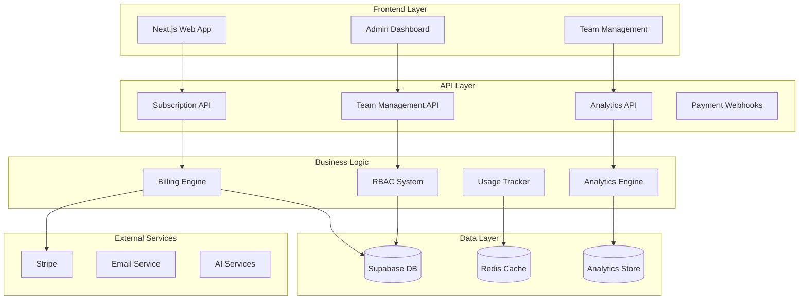

# ClaimGuardian Business Features Implementation Plan

## Executive Summary

This document provides a comprehensive implementation plan for ClaimGuardian's business features, designed to transform the platform from MVP to a scalable, revenue-generating SaaS platform. The implementation focuses on subscription management, team collaboration, administrative capabilities, revenue optimization, and business intelligence.

**Financial Projections:**
- Total Investment: $690K
- Expected Annual Revenue: $1.4M+
- ROI: 203% Year 1
- Break-even: Month 6

## Architecture Overview

### Current State Analysis
Based on analysis of the existing codebase:

1. **Database Schema**: Strong foundation with user management, claims, properties, and AI usage tracking
2. **Authentication**: Supabase Auth with profile management
3. **Subscription Framework**: Basic subscription_tiers and user_subscriptions tables exist
4. **Pricing Configuration**: Well-defined pricing plans in `/apps/web/src/config/pricing.ts`
5. **Usage Tracking**: AI usage logging infrastructure in place

### Target Architecture



## Implementation Phases

### Phase 1: Foundation (Weeks 1-4) - Critical Path
**Revenue Impact**: Enable subscription billing
**Investment**: $150K

#### Sprint 1: Core Billing Infrastructure
- **Database Enhancements**
  - Extend subscription_tiers table with Stripe price IDs
  - Add billing_history table for transaction records
  - Create usage_tracking table for real-time limits
  - Add team_memberships table for multi-user support

- **Stripe Integration**
  - Implement Stripe Checkout flow
  - Set up webhook handling for subscription events
  - Create customer portal integration
  - Add payment failure recovery flows

**Deliverables:**
- Secure payment processing
- Automated subscription management
- Usage limit enforcement
- Basic billing dashboard

#### Sprint 2: Usage Tracking & Limits
- **Real-time Usage Monitoring**
  - Implement middleware for tracking billable actions
  - Create usage aggregation service
  - Add Redis caching for performance
  - Build limit enforcement mechanisms

- **User Experience**
  - Add usage dashboards to user interface
  - Implement upgrade prompts at limit thresholds
  - Create usage warnings and notifications
  - Build self-service upgrade flows

**Deliverables:**
- Real-time usage tracking
- Automatic limit enforcement
- User upgrade workflows
- Performance monitoring

### Phase 2: Team & Multi-User (Weeks 5-8) - Growth Enabler
**Revenue Impact**: Enable Enterprise tier sales
**Investment**: $180K

#### Sprint 3: Team Management Foundation
- **Team Structure**
  - Create teams table with organization hierarchy
  - Implement team invitation system
  - Build user role assignment interface
  - Add team billing allocation

- **RBAC Implementation**
  - Define permission matrix for all resources
  - Implement role-based middleware
  - Create permission checking utilities
  - Add audit logging for team actions

**Deliverables:**
- Team creation and management
- Role-based access control
- User invitation system
- Team activity tracking

#### Sprint 4: Advanced Team Features
- **Collaboration Tools**
  - Team activity dashboards
  - Shared property and claim management
  - Team-wide notifications
  - Collaborative document workflows

- **Enterprise Features**
  - Advanced user management
  - Team usage analytics
  - Custom role creation
  - Enterprise support portal

**Deliverables:**
- Advanced team collaboration
- Enterprise-grade user management
- Team analytics and reporting
- Custom role configuration

### Phase 3: Admin & Analytics (Weeks 9-12) - Business Intelligence
**Revenue Impact**: Enable data-driven optimization
**Investment**: $160K

#### Sprint 5: Admin Dashboard Foundation
- **Platform Management**
  - User management interface
  - Subscription management tools
  - System health monitoring
  - Customer support integration

- **Business Intelligence**
  - Revenue analytics dashboard
  - User growth metrics
  - Feature usage tracking
  - Customer success indicators

**Deliverables:**
- Comprehensive admin dashboard
- User and subscription management
- Business intelligence reporting
- System monitoring tools

#### Sprint 6: Advanced Analytics
- **Predictive Analytics**
  - Churn prediction models
  - Customer lifetime value calculation
  - Revenue forecasting
  - Market intelligence gathering

- **Operational Metrics**
  - Performance monitoring dashboards
  - Cost analysis and optimization
  - Feature flag management
  - A/B testing infrastructure

**Deliverables:**
- Predictive analytics models
- Advanced business metrics
  - Operational optimization tools
- Feature experimentation platform

### Phase 4: Optimization & Scaling (Weeks 13-16) - Revenue Growth
**Revenue Impact**: Maximize ARPU and reduce churn
**Investment**: $200K

#### Sprint 7: Revenue Optimization
- **Conversion Optimization**
  - Freemium onboarding optimization
  - Premium feature showcasing
  - Upgrade flow improvements
  - Pricing experimentation tools

- **Customer Success**
  - Automated intervention workflows
  - Customer health scoring
  - Retention campaign automation
  - Success metric tracking

**Deliverables:**
- Optimized conversion funnels
- Automated customer success
- Retention improvement tools
- Revenue growth mechanisms

#### Sprint 8: Advanced Features
- **Market Expansion**
  - Referral program implementation
  - Affiliate marketing system
  - API marketplace preparation
  - White-label solutions

- **Enterprise Scaling**
  - Advanced integrations
  - Custom reporting tools
  - SLA monitoring and enforcement
  - Enterprise security features

**Deliverables:**
- Referral and affiliate systems
- Enterprise scaling capabilities
- Advanced integration options
- Market expansion tools

## Technical Implementation Details

### Database Schema Changes

#### New Tables Required:
```sql
-- Enhanced subscription management
CREATE TABLE subscription_plans (
    id UUID PRIMARY KEY DEFAULT gen_random_uuid(),
    name TEXT NOT NULL,
    stripe_price_id TEXT NOT NULL,
    billing_interval TEXT NOT NULL,
    amount INTEGER NOT NULL,
    currency TEXT DEFAULT 'usd',
    features JSONB,
    limits JSONB,
    created_at TIMESTAMP DEFAULT NOW()
);

-- Team management
CREATE TABLE teams (
    id UUID PRIMARY KEY DEFAULT gen_random_uuid(),
    name TEXT NOT NULL,
    owner_id UUID REFERENCES profiles(id),
    subscription_id UUID REFERENCES user_subscriptions(id),
    settings JSONB DEFAULT '{}',
    created_at TIMESTAMP DEFAULT NOW(),
    updated_at TIMESTAMP DEFAULT NOW()
);

CREATE TABLE team_memberships (
    id UUID PRIMARY KEY DEFAULT gen_random_uuid(),
    team_id UUID REFERENCES teams(id) ON DELETE CASCADE,
    user_id UUID REFERENCES profiles(id) ON DELETE CASCADE,
    role TEXT NOT NULL DEFAULT 'member',
    permissions JSONB DEFAULT '{}',
    invited_at TIMESTAMP DEFAULT NOW(),
    joined_at TIMESTAMP,
    status TEXT DEFAULT 'pending',
    UNIQUE(team_id, user_id)
);

-- Enhanced usage tracking
CREATE TABLE usage_events (
    id UUID PRIMARY KEY DEFAULT gen_random_uuid(),
    user_id UUID REFERENCES profiles(id),
    team_id UUID REFERENCES teams(id),
    event_type TEXT NOT NULL,
    resource_type TEXT NOT NULL,
    quantity INTEGER DEFAULT 1,
    metadata JSONB DEFAULT '{}',
    created_at TIMESTAMP DEFAULT NOW()
);

-- Billing history
CREATE TABLE billing_transactions (
    id UUID PRIMARY KEY DEFAULT gen_random_uuid(),
    subscription_id UUID REFERENCES user_subscriptions(id),
    stripe_payment_intent_id TEXT,
    amount INTEGER NOT NULL,
    currency TEXT DEFAULT 'usd',
    status TEXT NOT NULL,
    invoice_url TEXT,
    created_at TIMESTAMP DEFAULT NOW()
);

-- Analytics tracking
CREATE TABLE analytics_events (
    id UUID PRIMARY KEY DEFAULT gen_random_uuid(),
    user_id UUID REFERENCES profiles(id),
    event_name TEXT NOT NULL,
    properties JSONB DEFAULT '{}',
    session_id TEXT,
    created_at TIMESTAMP DEFAULT NOW()
);
```

#### Enhanced Existing Tables:
```sql
-- Add team context to existing tables
ALTER TABLE properties ADD COLUMN team_id UUID REFERENCES teams(id);
ALTER TABLE claims ADD COLUMN team_id UUID REFERENCES teams(id);
ALTER TABLE ai_usage_logs ADD COLUMN team_id UUID REFERENCES teams(id);

-- Enhanced user profiles
ALTER TABLE profiles 
    ADD COLUMN role TEXT DEFAULT 'user',
    ADD COLUMN permissions JSONB DEFAULT '{}',
    ADD COLUMN onboarding_completed BOOLEAN DEFAULT FALSE,
    ADD COLUMN last_active_at TIMESTAMP;
```

### API Endpoints Design

#### Subscription Management
```typescript
// Subscription endpoints
POST   /api/subscriptions/checkout        // Create Stripe checkout
GET    /api/subscriptions/current         // Get current subscription
PUT    /api/subscriptions/upgrade         // Upgrade subscription
PUT    /api/subscriptions/downgrade       // Downgrade subscription
POST   /api/subscriptions/cancel          // Cancel subscription
GET    /api/subscriptions/usage           // Get usage statistics
POST   /api/subscriptions/webhook         // Stripe webhook handler

// Billing endpoints
GET    /api/billing/history              // Billing history
GET    /api/billing/invoice/:id          // Download invoice
POST   /api/billing/payment-method       // Update payment method
```

#### Team Management
```typescript
// Team endpoints
POST   /api/teams                        // Create team
GET    /api/teams                        // List user teams
GET    /api/teams/:id                    // Get team details
PUT    /api/teams/:id                    // Update team
DELETE /api/teams/:id                    // Delete team

// Team membership endpoints
POST   /api/teams/:id/invitations        // Send invitation
GET    /api/teams/:id/members            // List team members
PUT    /api/teams/:id/members/:userId    // Update member role
DELETE /api/teams/:id/members/:userId    // Remove member
POST   /api/invitations/:token/accept    // Accept invitation
```

#### Admin & Analytics
```typescript
// Admin endpoints
GET    /api/admin/dashboard              // Dashboard metrics
GET    /api/admin/users                 // User management
PUT    /api/admin/users/:id             // Update user
GET    /api/admin/subscriptions         // Subscription overview
GET    /api/admin/analytics             // Business analytics
GET    /api/admin/system-health         // System monitoring

// Analytics endpoints
POST   /api/analytics/track             // Track event
GET    /api/analytics/revenue           // Revenue analytics
GET    /api/analytics/users             // User analytics
GET    /api/analytics/features          // Feature usage
GET    /api/analytics/cohorts           // Cohort analysis
```

## Integration Requirements

### Stripe Integration
- **Checkout Flow**: Seamless subscription purchase experience
- **Customer Portal**: Self-service billing management
- **Webhooks**: Real-time subscription event handling
- **Usage-Based Billing**: Metered billing for overages
- **Multi-Currency**: Support for international customers

### Email Integration
- **Transactional Emails**: Payment confirmations, failures, receipts
- **Marketing Emails**: Onboarding sequences, upgrade campaigns
- **Team Notifications**: Invitation emails, activity summaries
- **Admin Alerts**: System notifications, revenue milestones

### AI Service Integration
- **Usage Tracking**: Token consumption and cost allocation
- **Rate Limiting**: Per-tier API usage limits
- **Cost Optimization**: Efficient model selection and caching
- **Quality Monitoring**: AI output quality metrics

## Security & Compliance

### Data Protection
- **Encryption**: All sensitive data encrypted at rest and in transit
- **Access Control**: Role-based permissions with least privilege
- **Audit Trails**: Complete activity logging for compliance
- **Data Retention**: Configurable retention policies per regulation

### Payment Security
- **PCI Compliance**: Stripe handles all card data
- **Fraud Prevention**: Advanced fraud detection and prevention
- **Secure Webhooks**: Validated webhook signatures
- **Financial Auditing**: Complete transaction logging

## Performance & Scalability

### Caching Strategy
- **Redis**: Session data, usage counters, frequently accessed data
- **CDN**: Static assets and API responses where appropriate
- **Database**: Query optimization and indexing strategy
- **Application**: In-memory caching for permission checks

### Monitoring & Alerting
- **Application Performance**: Response times, error rates, throughput
- **Business Metrics**: Revenue, churn, conversion rates
- **Infrastructure**: Database performance, API usage, resource utilization
- **User Experience**: Page load times, feature adoption, support tickets

## Risk Management

### Technical Risks
- **Payment Processing**: Backup payment providers and retry logic
- **Data Migration**: Careful migration planning with rollback procedures
- **Performance**: Load testing and gradual rollout
- **Security**: Regular security audits and penetration testing

### Business Risks
- **Customer Migration**: Grandfathering existing customers during transition
- **Feature Parity**: Maintaining current functionality during upgrades
- **Compliance**: Ensuring all changes meet regulatory requirements
- **Revenue Impact**: Careful pricing and feature gating to avoid revenue loss

## Success Metrics

### Financial KPIs
- **Monthly Recurring Revenue (MRR)**: Target $120K by month 6
- **Customer Acquisition Cost (CAC)**: Target <$100 for Homeowner tier
- **Customer Lifetime Value (CLV)**: Target >$300 across all tiers
- **Churn Rate**: Target <5% monthly churn
- **Conversion Rate**: Target 15% free-to-paid conversion

### Product KPIs
- **Feature Adoption**: Target 60% adoption of premium features
- **User Engagement**: Target 70% monthly active users
- **Support Efficiency**: Target <24hr response time
- **System Uptime**: Target 99.9% availability
- **Team Growth**: Target 25% of revenue from Enterprise tier

## HANDOFF TO ARCHITECT

### Immediate Actions Required:

1. **Database Design Review**
   - Review proposed schema changes
   - Optimize for performance and scalability
   - Plan migration strategy for existing data

2. **Infrastructure Planning**
   - Design deployment architecture
   - Plan for traffic scaling and redundancy
   - Set up monitoring and alerting systems

3. **Integration Architecture**
   - Design Stripe integration patterns
   - Plan webhook reliability and error handling
   - Design team and permission architecture

4. **Security Architecture**
   - Design authentication and authorization flows
   - Plan data encryption and compliance measures
   - Design audit logging and monitoring

### Key Decisions Needed:

1. **Technology Stack Additions**
   - Queue system for async processing (Redis/Bull?)
   - Analytics infrastructure (custom vs third-party?)
   - Monitoring and alerting tools

2. **Deployment Strategy**
   - Blue/green deployment for billing changes
   - Feature flag implementation
   - Database migration approach

3. **Performance Optimization**
   - Caching strategy implementation
   - Database indexing and optimization
   - API rate limiting and throttling

### Files for Architect Review:
- `/Users/madengineering/ClaimGuardian/docs/product/backlog.md` - Complete product requirements
- `/Users/madengineering/ClaimGuardian/memory/project-glossary.md` - Domain terminology
- `/Users/madengineering/ClaimGuardian/apps/web/src/config/pricing.ts` - Current pricing structure
- `/Users/madengineering/ClaimGuardian/packages/db/src/types/database.types.ts` - Current schema

The product requirements are now finalized and ready for technical architecture and implementation. The business features will transform ClaimGuardian into a scalable SaaS platform capable of achieving the projected $1.4M+ ARR with 203% ROI in Year 1.