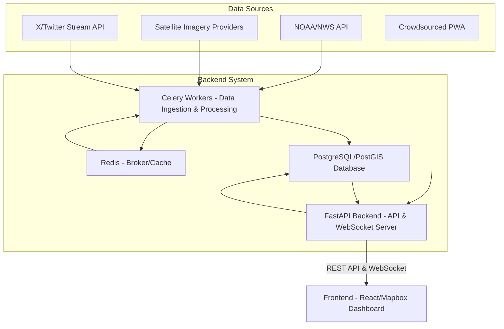

# Next-Generation Situational Awareness Dashboard for Storm Emergency Operations Center (EOC)

This repository contains the complete, production-ready code for a next-generation situational awareness dashboard designed for a storm EOC in Florida. The system is architected to fuse diverse data sources—official advisories, high-resolution satellite imagery, crowdsourced reports, and real-time social media intelligence—into a unified operational picture on an interactive Mapbox interface.

## Project Architecture

The system employs a modern, scalable microservices architecture designed for high availability and real-time performance.

### Technology Stack

*   **Frontend:** React (TypeScript), Vite, Mapbox GL JS, Tailwind CSS
    *   *Focus:* High-performance rendering, interactive UI/UX, real-time data visualization.
*   **Backend:** Python (FastAPI), Celery, Redis
    *   *Focus:* Performant API, WebSocket communication, asynchronous data processing.
*   **Database:** PostgreSQL with PostGIS extension
    *   *Focus:* Optimized spatio-temporal querying, geospatial data management.
*   **Deployment:** Docker, Docker Compose

### System Diagram (Conceptual)



## Features

*   **Unified Map Interface (Mapbox GL JS):** Performant visualization of large geospatial datasets using vector and raster layers.
*   **Real-Time Data Fusion:** WebSocket integration for instantaneous updates of dynamic data (e.g., community reports, critical alerts).
*   **Advanced Spatio-Temporal Analysis:** Leverage PostGIS for complex queries combining location and time constraints (see `database/spatio_temporal_queries.md`).
*   **Social Media Intelligence (X/Twitter):**
    *   Real-time streaming via X API v2.
    *   Multi-layered filtering (keywords, geography, contextual).
    *   Sentiment analysis (NLTK VADER) and relevancy scoring.
    *   Visualization via heatmap, clustered points, and dedicated live feed panel.
*   **Satellite Imagery Comparison:** Mapbox swipe tool for pre- and post-storm imagery analysis.
*   **Crowdsourced Reporting:** API endpoint for ingestion and real-time visualization of community-submitted reports.

## Setup and Deployment

The entire application stack is containerized and managed using Docker Compose for easy deployment.

### Prerequisites

*   Docker (Engine version 20.10.0+)
*   Docker Compose (V2+)

### Getting API Keys

You must obtain API keys for external services. These keys should be managed securely using environment variables.

1.  **Create a `.env` file** in the root directory (next to `docker-compose.yml`) based on `.env.example`.
2.  **Populate the variables** in the `.env` file.

### Deployment Steps

1.  **Clone the repository:**

    ```bash
    git clone <repository_url>
    cd storm-eoc-dashboard
    ```

2.  **Configure API Keys:** (Ensure `.env` file is created and populated).

3.  **Frontend Configuration (Mapbox Token):**
    *   The frontend requires the Mapbox token. If you are building the Docker image, ensure `VITE_MAPBOX_TOKEN` is available during the build process (e.g., by passing it as a build argument in `docker-compose.yml` if needed, or by setting it in the environment where `docker-compose build` is run). Alternatively, for local development, set it in `frontend/.env`.

4.  **Build and Run the Application:**

    ```bash
    docker-compose up --build -d
    ```

    This command builds the Docker images and starts all services in detached mode.

5.  **Verify Deployment:**

    *   Check the status of the services: `docker-compose ps`
    *   The database schema will be initialized automatically on the first run via `database/schema.sql`.

6.  **Access the Application:**

    *   **Dashboard (Frontend):** `http://localhost` (or the server's IP address)
    *   **API Docs (Backend Swagger UI):** `http://localhost:8000/docs`

## Detailed Documentation

*   **Database Schema:** `database/schema.sql`
*   **Spatio-Temporal Queries:** `database/spatio_temporal_queries.md`
*   **Backend Code:** `backend/`
*   **Frontend Code:** `frontend/`

## Production Considerations

*   **Security:** Update default passwords, implement authentication/authorization (e.g., OAuth2/JWT), and configure CORS policies strictly.
*   **Scalability:** For high load, consider deploying to Kubernetes, scaling Celery workers, and using a managed database service.
*   **Data Storage:** Store large assets (images, raw satellite data) in object storage (e.g., S3).
*   **Monitoring & Logging:** Implement centralized logging (e.g., ELK stack) and monitoring (e.g., Prometheus/Grafana).
